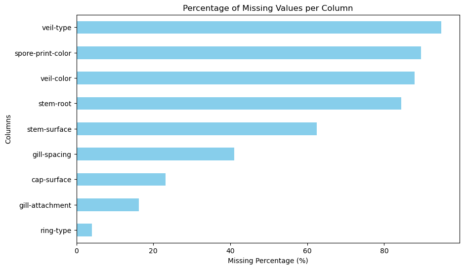
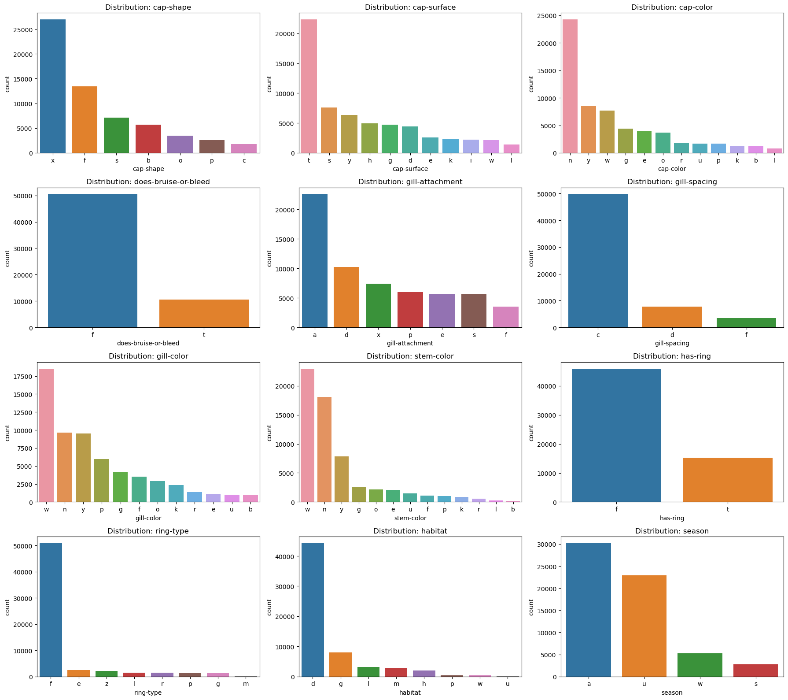
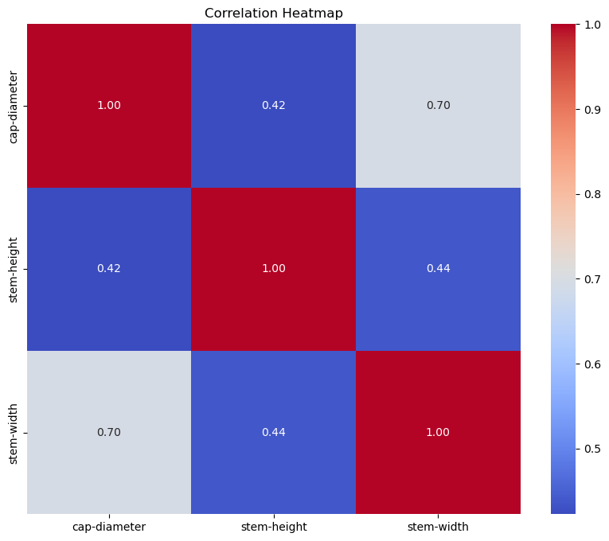
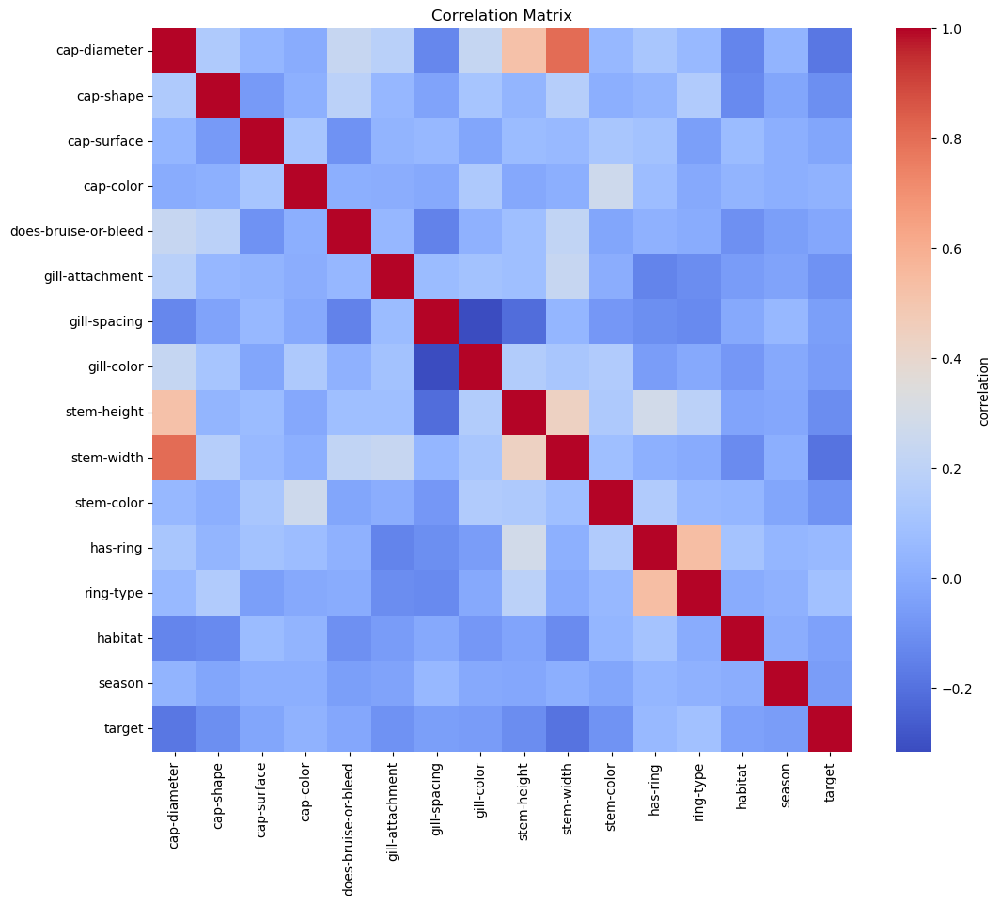
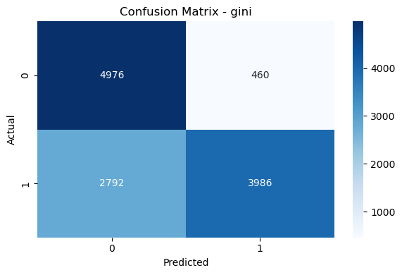
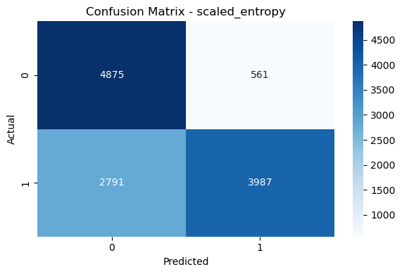
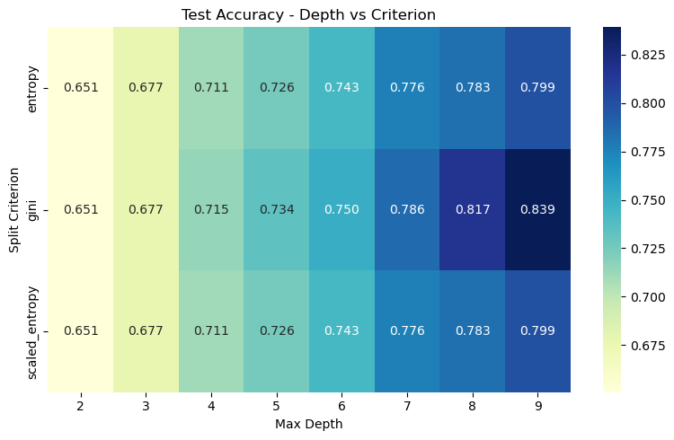

```python
import os
import numpy as np
import pandas as pd
from ucimlrepo import fetch_ucirepo

# --------------------
# Dataset Upload
# --------------------
def fetch_dataset(folder="dataset"):
    if os.path.exists(folder):
        X = pd.read_csv(os.path.join(folder, "X.csv"))
        y = pd.read_csv(os.path.join(folder, "y.csv"))
        variables = pd.read_csv(os.path.join(folder, "variables.csv"))

        metadata = None
        return {"X": X, "y": y, "metadata": metadata, "variables": variables}

    secondary_mushroom = fetch_ucirepo(id=848)
    X = secondary_mushroom.data.features
    y = secondary_mushroom.data.targets

    dataset = {
        "X": X,
        "y": y,
        "metadata": secondary_mushroom.metadata,
        "variables": secondary_mushroom.variables,
    }

    os.makedirs(folder, exist_ok=True)
    X.to_csv(os.path.join(folder, "X.csv"), index=False)
    y.to_csv(os.path.join(folder, "y.csv"), index=False)
    dataset["variables"].to_csv(os.path.join(folder, "variables.csv"), index=False)

    return dataset
    
def preprocess_data(df, variables, filepath=None):
    if filepath is not None and not os.path.exists(filepath):
        variables = variables[variables.type == "Categorical"]
        variables = variables[variables.role != "Target"]

        CAT2IDX = {}
        for col in variables.name:
            uniques = remove_ifnan(df[col].unique())
            CAT2IDX[col] = {uniques[idx]: idx for idx in range(len(uniques))}
            if variables[variables.name == col].missing_values.values[0] == "yes":
                CAT2IDX[col][np.nan] = -1

        for idx in range(len(df)):
            for col in df.iloc[idx].index:
              if col in CAT2IDX.keys():
                    df.loc[idx, col] = CAT2IDX[col].get(df.loc[idx, col], -1)

        df.to_csv(filepath, index=False)
        return df

 
    return pd.read_csv(filepath)

# ------------------------
# Main Funciton
# ------------------------
from sklearn.preprocessing import LabelEncoder

def main():
    dataset = fetch_dataset()

    X = pd.get_dummies(dataset["X"])

    y = LabelEncoder().fit_transform(dataset["y"].values.ravel())

    return {
        "X": X,
        "y": y,
        "variables": dataset["variables"],
        "feature_names": X.columns.tolist()
    }

```


```python
# ------------------------
# Main Funciton
# ------------------------

# Load Dataset
dataset_dict = fetch_dataset()
dataset_dict["X"].head()
```


<div>
<style scoped>
    .dataframe tbody tr th:only-of-type {
        vertical-align: middle;
    }

    .dataframe tbody tr th {
        vertical-align: top;
    }

    .dataframe thead th {
        text-align: right;
    }
</style>
<table border="1" class="dataframe">
  <thead>
    <tr style="text-align: right;">
      <th></th>
      <th>Unnamed: 0</th>
      <th>cap-diameter</th>
      <th>cap-shape</th>
      <th>cap-surface</th>
      <th>cap-color</th>
      <th>does-bruise-or-bleed</th>
      <th>gill-attachment</th>
      <th>gill-spacing</th>
      <th>gill-color</th>
      <th>stem-height</th>
      <th>...</th>
      <th>stem-root</th>
      <th>stem-surface</th>
      <th>stem-color</th>
      <th>veil-type</th>
      <th>veil-color</th>
      <th>has-ring</th>
      <th>ring-type</th>
      <th>spore-print-color</th>
      <th>habitat</th>
      <th>season</th>
    </tr>
  </thead>
  <tbody>
    <tr>
      <th>0</th>
      <td>0</td>
      <td>15.26</td>
      <td>x</td>
      <td>g</td>
      <td>o</td>
      <td>f</td>
      <td>e</td>
      <td>NaN</td>
      <td>w</td>
      <td>16.95</td>
      <td>...</td>
      <td>s</td>
      <td>y</td>
      <td>w</td>
      <td>u</td>
      <td>w</td>
      <td>t</td>
      <td>g</td>
      <td>NaN</td>
      <td>d</td>
      <td>w</td>
    </tr>
    <tr>
      <th>1</th>
      <td>1</td>
      <td>16.60</td>
      <td>x</td>
      <td>g</td>
      <td>o</td>
      <td>f</td>
      <td>e</td>
      <td>NaN</td>
      <td>w</td>
      <td>17.99</td>
      <td>...</td>
      <td>s</td>
      <td>y</td>
      <td>w</td>
      <td>u</td>
      <td>w</td>
      <td>t</td>
      <td>g</td>
      <td>NaN</td>
      <td>d</td>
      <td>u</td>
    </tr>
    <tr>
      <th>2</th>
      <td>2</td>
      <td>14.07</td>
      <td>x</td>
      <td>g</td>
      <td>o</td>
      <td>f</td>
      <td>e</td>
      <td>NaN</td>
      <td>w</td>
      <td>17.80</td>
      <td>...</td>
      <td>s</td>
      <td>y</td>
      <td>w</td>
      <td>u</td>
      <td>w</td>
      <td>t</td>
      <td>g</td>
      <td>NaN</td>
      <td>d</td>
      <td>w</td>
    </tr>
    <tr>
      <th>3</th>
      <td>3</td>
      <td>14.17</td>
      <td>f</td>
      <td>h</td>
      <td>e</td>
      <td>f</td>
      <td>e</td>
      <td>NaN</td>
      <td>w</td>
      <td>15.77</td>
      <td>...</td>
      <td>s</td>
      <td>y</td>
      <td>w</td>
      <td>u</td>
      <td>w</td>
      <td>t</td>
      <td>p</td>
      <td>NaN</td>
      <td>d</td>
      <td>w</td>
    </tr>
    <tr>
      <th>4</th>
      <td>4</td>
      <td>14.64</td>
      <td>x</td>
      <td>h</td>
      <td>o</td>
      <td>f</td>
      <td>e</td>
      <td>NaN</td>
      <td>w</td>
      <td>16.53</td>
      <td>...</td>
      <td>s</td>
      <td>y</td>
      <td>w</td>
      <td>u</td>
      <td>w</td>
      <td>t</td>
      <td>p</td>
      <td>NaN</td>
      <td>d</td>
      <td>w</td>
    </tr>
  </tbody>
</table>
<p>5 rows × 21 columns</p>
</div>


```python
# ------------------------
# General information
# ------------------------

print("\nNumber of samples:", len(dataset_dict["X"]))
print("\nInfo variabiles:")
print(dataset_dict["variables"])
```

    
    Number of samples: 61069
    
    Info variabiles:
        Unnamed: 0                  name     role         type  demographic  \
    0            0                 class   Target  Categorical          NaN   
    1            1          cap-diameter  Feature   Continuous          NaN   
    2            2             cap-shape  Feature  Categorical          NaN   
    3            3           cap-surface  Feature  Categorical          NaN   
    4            4             cap-color  Feature  Categorical          NaN   
    5            5  does-bruise-or-bleed  Feature  Categorical          NaN   
    6            6       gill-attachment  Feature  Categorical          NaN   
    7            7          gill-spacing  Feature  Categorical          NaN   
    8            8            gill-color  Feature  Categorical          NaN   
    9            9           stem-height  Feature   Continuous          NaN   
    10          10            stem-width  Feature   Continuous          NaN   
    11          11             stem-root  Feature  Categorical          NaN   
    12          12          stem-surface  Feature  Categorical          NaN   
    13          13            stem-color  Feature  Categorical          NaN   
    14          14             veil-type  Feature  Categorical          NaN   
    15          15            veil-color  Feature  Categorical          NaN   
    16          16              has-ring  Feature  Categorical          NaN   
    17          17             ring-type  Feature  Categorical          NaN   
    18          18     spore-print-color  Feature  Categorical          NaN   
    19          19               habitat  Feature  Categorical          NaN   
    20          20                season  Feature  Categorical          NaN   
    
        description  units missing_values  
    0           NaN    NaN             no  
    1           NaN    NaN             no  
    2           NaN    NaN             no  
    3           NaN    NaN            yes  
    4           NaN    NaN             no  
    5           NaN    NaN             no  
    6           NaN    NaN            yes  
    7           NaN    NaN            yes  
    8           NaN    NaN             no  
    9           NaN    NaN             no  
    10          NaN    NaN             no  
    11          NaN    NaN            yes  
    12          NaN    NaN            yes  
    13          NaN    NaN             no  
    14          NaN    NaN            yes  
    15          NaN    NaN            yes  
    16          NaN    NaN             no  
    17          NaN    NaN            yes  
    18          NaN    NaN            yes  
    19          NaN    NaN             no  
    20          NaN    NaN             no  


```python
# ------------------------
# Analyzing missing value 
# ------------------------

import pandas as pd
import matplotlib.pyplot as plt

total_missing = dataset_dict["X"].isnull().sum().sum()
missing_per_column = dataset_dict["X"].isnull().sum()
missing_percentage = dataset_dict["X"].isnull().mean() * 100

missing_data = pd.DataFrame({
    'Missing Values': missing_per_column,
    'Missing Percentage': missing_percentage
})

missing_data = missing_data[missing_data['Missing Values'] > 0]

print(missing_data)

plt.figure(figsize=(10, 6))
missing_data['Missing Percentage'].sort_values().plot(kind='barh', color='skyblue')
plt.title('Percentage of Missing Values per Column')
plt.xlabel('Missing Percentage (%)')
plt.ylabel('Columns')
plt.show()

# ------------------------------
# Handle missing values
# ------------------------------

# 1. Remove columns with more than 50% missing values
threshold = 50
columns_to_drop = missing_data[missing_data['Missing Percentage'] > threshold].index
dataset_dict_cleaned = dataset_dict["X"].drop(columns=columns_to_drop)

print(f"\nColumns removed: {columns_to_drop.tolist()}")

# 2. Impute remaining missing values with mode
for column in dataset_dict_cleaned.columns:
    if dataset_dict_cleaned[column].isnull().sum() > 0:
        mode_value = dataset_dict_cleaned[column].mode()[0] 
        dataset_dict_cleaned[column].fillna(mode_value, inplace=True)
        print(f"Imputed missing values in column: {column} with mode value: {mode_value}")

total_missing_after = dataset_dict_cleaned.isnull().sum().sum()
print(f"\nNumber of total missing values: {total_missing_after}")
dataset_dict["X"] = dataset_dict_cleaned

# ------------------------
# Statistical Analysis - numeric columns
# ------------------------


print("Statistical Analysis for numeric columns:\n") 
dataset_dict["X"] = dataset_dict["X"].drop(columns="Unnamed: 0", errors="ignore")
print(dataset_dict["X"].describe().round(1))
```

                       Missing Values  Missing Percentage
    cap-surface                 14120           23.121387
    gill-attachment              9884           16.184971
    gill-spacing                25063           41.040462
    stem-root                   51538           84.393064
    stem-surface                38124           62.427746
    veil-type                   57892           94.797688
    veil-color                  53656           87.861272
    ring-type                    2471            4.046243
    spore-print-color           54715           89.595376


    

    


    
    Columns removed: ['stem-root', 'stem-surface', 'veil-type', 'veil-color', 'spore-print-color']
    Imputed missing values in column: cap-surface with mode value: t
    Imputed missing values in column: gill-attachment with mode value: a
    Imputed missing values in column: gill-spacing with mode value: c
    Imputed missing values in column: ring-type with mode value: f
    
    Number of total missing values: 0
    Statistical Analysis for numeric columns:
    
           cap-diameter  stem-height  stem-width
    count       61069.0      61069.0     61069.0
    mean            6.7          6.6        12.1
    std             5.3          3.4        10.0
    min             0.4          0.0         0.0
    25%             3.5          4.6         5.2
    50%             5.9          6.0        10.2
    75%             8.5          7.7        16.6
    max            62.3         33.9       103.9


```python
# ------------------------
# Distribution of the categorical variables
# ------------------------


import matplotlib.pyplot as plt
import seaborn as sns
import math

categorical_cols = dataset_dict["X"].select_dtypes(include='object').columns

n_cols = 3
n_rows = math.ceil(len(categorical_cols) / n_cols)

fig, axes = plt.subplots(n_rows, n_cols, figsize=(18, 4 * n_rows))
axes = axes.flatten()

for i, col in enumerate(categorical_cols):
    sns.countplot(data=dataset_dict["X"], x=col, order=dataset_dict["X"][col].value_counts().index, ax=axes[i])
    axes[i].set_title(f'Distribution: {col}')
    axes[i].tick_params(axis='x')

for j in range(i + 1, len(axes)):
    fig.delaxes(axes[j])

plt.tight_layout()
plt.show()
```


    

    


```python
# ------------------------
# Distribution of the numeric variables
# ------------------------

import matplotlib.pyplot as plt
import seaborn as sns

numeric_cols = dataset_dict["X"].select_dtypes(include=['int64', 'float64']).columns

fig, axes = plt.subplots(1, len(numeric_cols), figsize=(5 * len(numeric_cols), 4))

for ax, col in zip(axes, numeric_cols):
    sns.histplot(dataset_dict["X"][col], kde=True, ax=ax)
    ax.set_title(f'{col}')
    ax.set_xlabel('')
    ax.set_ylabel('')

plt.suptitle('Distribution of numeric variables', fontsize=16)
plt.tight_layout()
plt.show()
```


    

    


```python
# ------------------------
# Correlation Matrix - numeric columns
# ------------------------

correlation_matrix = dataset_dict["X"].corr()

print("Correlation Matrix:\n")
print(correlation_matrix)

import seaborn as sns
import matplotlib.pyplot as plt

plt.figure(figsize=(10, 8))
sns.heatmap(correlation_matrix, annot=True, cmap="coolwarm", fmt=".2f")
plt.title("Correlation Heatmap")
plt.show()
```

    Correlation Matrix:
    
                  cap-diameter  stem-height  stem-width
    cap-diameter       1.00000     0.422560    0.695330
    stem-height        0.42256     1.000000    0.436117
    stem-width         0.69533     0.436117    1.000000


    

    


```python
# ------------------------
# Correlation Matrix - converting categorical into numeric value
# ------------------------

import pandas as pd
import seaborn as sns
import matplotlib.pyplot as plt

df_encoded = dataset_dict["X"].apply(pd.Categorical).apply(lambda x: x.cat.codes)
df_encoded['target'] = dataset_dict["y"]['class'].astype('category').cat.codes

corr_matrix = df_encoded.corr()

plt.figure(figsize=(12, 10))
sns.heatmap(corr_matrix, cmap='coolwarm', fmt='.2f', cbar_kws={'label': 'correlation'})
plt.title('Correlation Matrix')
plt.show()
```


    

    


```python
import os
import numpy as np
import pandas as pd
from ucimlrepo import fetch_ucirepo
from sklearn.model_selection import train_test_split
from sklearn.metrics import accuracy_score, confusion_matrix
from sklearn.preprocessing import LabelEncoder
import matplotlib.pyplot as plt
import seaborn as sns
from graphviz import Digraph
import time


# --------------------
# Decision Tree Classes
# --------------------

class TreeNode:
    def __init__(self, feature=None, threshold=None, left=None, right=None, value=None):
        self.feature = feature
        self.threshold = threshold
        self.left = left
        self.right = right
        self.value = value

    def is_leaf(self):
        return self.value is not None

class DecisionTree:
    
    def __init__(self, max_depth=None, min_samples_split=2, entropy_threshold=None,
                 max_leaf_nodes=None, split_function='gini', feature_names=None):
        self.max_depth = max_depth
        self.min_samples_split = min_samples_split
        self.entropy_threshold = entropy_threshold
        self.max_leaf_nodes = max_leaf_nodes
        self.feature_names = feature_names
        self.root = None
        self.leaf_count = 0

        if split_function == 'gini':
            self.criterion_func = self.gini
        elif split_function == 'entropy':
            self.criterion_func = self.entropy
        elif split_function == 'scaled_entropy':
            self.criterion_func = self.scaled_entropy
        else:
            raise ValueError("Unsupported criterion")


    def fit(self, X, y):
        self.root = self.grow_tree(X, y)

    def predict(self, X):
        return np.array([self.predict_one(x, self.root) for x in X])

    def predict_one(self, x, node):
        if node.is_leaf():
            return node.value
        if x[node.feature] <= node.threshold:
            return self.predict_one(x, node.left)
        return self.predict_one(x, node.right)

    def grow_tree(self, X, y, depth=0):
        if (len(set(y)) == 1 or
            len(y) < self.min_samples_split or
            (self.max_depth is not None and depth >= self.max_depth) or
            (self.entropy_threshold is not None and self.criterion_func(y) < self.entropy_threshold) or
            (self.max_leaf_nodes is not None and self.leaf_count >= self.max_leaf_nodes)):
            return TreeNode(value=self.most_common(y))

        best_feat, best_thresh = self.best_split(X, y)
        if best_feat is None:
            return TreeNode(value=self.most_common(y))

        self.leaf_count += 1
        left_idx = X[:, best_feat] <= best_thresh
        right_idx = ~left_idx
        left = self.grow_tree(X[left_idx], y[left_idx], depth + 1)
        right = self.grow_tree(X[right_idx], y[right_idx], depth + 1)

        return TreeNode(feature=best_feat, threshold=best_thresh, left=left, right=right)

    def best_split(self, X, y):
        best_gain, best_feat, best_thresh = -1, None, None
        for feature in range(X.shape[1]):
            thresholds = np.unique(X[:, feature])
            for thresh in thresholds:
                left_idx = X[:, feature] <= thresh
                right_idx = ~left_idx
                if len(y[left_idx]) == 0 or len(y[right_idx]) == 0:
                    continue
                gain = self.information_gain(y, y[left_idx], y[right_idx])
                if gain > best_gain:
                    best_gain, best_feat, best_thresh = gain, feature, thresh
        return best_feat, best_thresh

    def information_gain(self, parent, left, right):
        weight_l = len(left) / len(parent)
        weight_r = len(right) / len(parent)
        return self.criterion_func(parent) - (weight_l * self.criterion_func(left) + weight_r * self.criterion_func(right))

    def most_common(self, y):
        return np.bincount(y).argmax()

    def gini(self, y):
        probs = np.bincount(y) / len(y)
        return 1 - np.sum(probs ** 2)

    def entropy(self, y):
        probs = np.bincount(y) / len(y)
        return -sum(p * np.log2(p + 1e-9) for p in probs if p > 0)

    def scaled_entropy(self, y):
        probs = np.bincount(y) / len(y)
        return -sum((p / 2) * np.log2(p + 1e-9) for p in probs if p > 0)

    def visualize(self):
        dot = Digraph()
        self.visualize_tree(self.root, dot)
        return dot

    def visualize_tree(self, node, dot, parent_id=None, edge_label=""):
        current_id = str(id(node))
    
        if node.is_leaf():
            label = f"Predict: {node.value}"
            dot.node(current_id, label, shape="ellipse", style="filled", fillcolor="lightgreen")
        else:
            name = self.feature_names[node.feature] if self.feature_names else f"X[{node.feature}]"
            label = f"{name} <= {node.threshold}"
            dot.node(current_id, label, shape="box", style="filled", fillcolor="lightblue")
        if parent_id is not None:
            dot.edge(parent_id, current_id, label=edge_label)
        if node.left:
            self.visualize_tree(node.left, dot, current_id, "True")
        if node.right:
            self.visualize_tree(node.right, dot, current_id, "False")

```


```python
import pandas as pd
from sklearn.model_selection import train_test_split
from sklearn.preprocessing import LabelEncoder

def main():

    dataset = fetch_dataset()

    if "Unnamed: 0" in dataset["X"].columns:
        dataset["X"] = dataset["X"].drop(columns=["Unnamed: 0"])
    if "Unnamed: 0" in dataset["y"].columns:
        dataset["y"] = dataset["y"].drop(columns=["Unnamed: 0"])

    # Feature and Target
    X_raw = dataset["X"]
    y_raw = dataset["y"]

    # One-hot encoding - feature
    X = pd.get_dummies(X_raw)

    # Label encoding
    y = LabelEncoder().fit_transform(y_raw.values.ravel().astype(str))

    # Training and test set
    X_train_raw, X_test_raw, y_train, y_test = train_test_split(
        X, y, test_size=0.2, stratify=y, random_state=42
    )

    X_train = X_train_raw.copy()
    X_test = X_test_raw.reindex(columns=X_train.columns, fill_value=0)

    return {
        "X_train": X_train,
        "X_test": X_test,
        "y_train": y_train,
        "y_test": y_test,
        "feature_names": X_train.columns.tolist()
    }
```


```python
import numpy as np
from sklearn.metrics import accuracy_score, confusion_matrix
import matplotlib.pyplot as plt
import seaborn as sns
import time

if __name__ == "__main__":
    data = main()
    X_train = data["X_train"].values
    X_test = data["X_test"].values
    y_train = data["y_train"]
    y_test = data["y_test"]
    feature_names = data["feature_names"]

    for criterion in ['gini', 'entropy', 'scaled_entropy']:
        print(f"\nUsing split function: {criterion}")
        tree_model = DecisionTree(
            max_depth=5,
            min_samples_split=5,
            entropy_threshold=0.01,
            split_function=criterion,
            feature_names=feature_names
        )
        
        # Training
        start_time = time.time()
        tree_model.fit(X_train, y_train)
        end_time = time.time()
        print(f"Training time: {end_time - start_time:.2f} sec")

        # Assessment
        y_pred = tree_model.predict(X_test)
        acc = accuracy_score(y_test, y_pred)
        print(f"Test Accuracy: {acc:.4f}")
        print(f"Zero-One Loss: {np.mean(y_pred != y_test):.4f}")

        # Confusion matrix
        cm = confusion_matrix(y_test, y_pred)
        plt.figure(figsize=(6, 4))
        sns.heatmap(cm, annot=True, cmap='Blues', fmt='d')
        plt.xlabel("Predicted")
        plt.ylabel("Actual")
        plt.title(f"Confusion Matrix - {criterion}")
        plt.tight_layout()
        plt.show()

        # Tree visualization
        tree_graph = tree_model.visualize()
        tree_graph.render(f"tree_visual_{criterion}", format="png", view=True)

```

    
    Using split function: gini
    Training time: 59.35 sec
    Test Accuracy: 0.7337
    Zero-One Loss: 0.2663


    

    


    
    Using split function: entropy
    Training time: 62.05 sec
    Test Accuracy: 0.7256
    Zero-One Loss: 0.2744


    

    


    
    Using split function: scaled_entropy
    Training time: 56.78 sec
    Test Accuracy: 0.7256
    Zero-One Loss: 0.2744


    

    


```python
# ------------------------
# Hyperparameter Tuning
# ------------------------
import pandas as pd
import seaborn as sns
import matplotlib.pyplot as plt
from sklearn.metrics import accuracy_score

split_criteria = ['gini', 'entropy', 'scaled_entropy']
depth_range = [2, 3, 4, 5, 6, 7, 8, 9]

results = []

for criterion in split_criteria:
    for depth in depth_range:
        #Model Preparation
        tree = DecisionTree(
            max_depth=depth,
            min_samples_split=5,
            entropy_threshold=0.01,
            split_function=criterion,
            feature_names=feature_names
        )

        #Training
        tree.fit(X_train, y_train)

        #Assessment
        y_train_pred = tree.predict(X_train)
        y_test_pred = tree.predict(X_test)
        train_acc = accuracy_score(y_train, y_train_pred)
        test_acc = accuracy_score(y_test, y_test_pred)

        results.append({
            "Criterion": criterion,
            "Max Depth": depth,
            "Train Accuracy": train_acc,
            "Test Accuracy": test_acc,
            "Overfitting Gap": train_acc - test_acc
        })


results_df = pd.DataFrame(results)
results_df = results_df.sort_values(by=["Criterion", "Max Depth"])
print(results_df.to_string(index=False))

#Visualization
pivot = results_df.pivot(index="Criterion", columns="Max Depth", values="Test Accuracy")

plt.figure(figsize=(8, 5))
sns.heatmap(pivot, annot=True, fmt=".3f", cmap="YlGnBu")
plt.title("Test Accuracy - Depth vs Criterion")
plt.xlabel("Max Depth")
plt.ylabel("Split Criterion")
plt.tight_layout()
plt.show()
```

         Criterion  Max Depth  Train Accuracy  Test Accuracy  Overfitting Gap
           entropy          2        0.652973       0.650565         0.002408
           entropy          3        0.681957       0.677092         0.004865
           entropy          4        0.709631       0.710660        -0.001029
           entropy          5        0.723836       0.725561        -0.001725
           entropy          6        0.740477       0.742836        -0.002359
           entropy          7        0.773432       0.775831        -0.002399
           entropy          8        0.781783       0.783363        -0.001581
           entropy          9        0.797012       0.799001        -0.001990
              gini          2        0.652973       0.650565         0.002408
              gini          3        0.681957       0.677092         0.004865
              gini          4        0.713172       0.714508        -0.001336
              gini          5        0.731471       0.733748        -0.002277
              gini          6        0.748787       0.750287        -0.001499
              gini          7        0.784689       0.786393        -0.001703
              gini          8        0.817173       0.816604         0.000569
              gini          9        0.839280       0.839201         0.000079
    scaled_entropy          2        0.652973       0.650565         0.002408
    scaled_entropy          3        0.681957       0.677092         0.004865
    scaled_entropy          4        0.709631       0.710660        -0.001029
    scaled_entropy          5        0.723836       0.725561        -0.001725
    scaled_entropy          6        0.740477       0.742836        -0.002359
    scaled_entropy          7        0.773370       0.775831        -0.002461
    scaled_entropy          8        0.781701       0.783363        -0.001662
    scaled_entropy          9        0.796930       0.799001        -0.002071


    

    


```python
import pandas as pd

results_df["Overfitting Gap"] = results_df["Train Accuracy"] - results_df["Test Accuracy"]

#Best - test accuracy
best_test_model = results_df.loc[results_df["Test Accuracy"].idxmax()]

#Best - overfitting gap
best_balanced_model = results_df.loc[results_df["Overfitting Gap"].abs().idxmin()]

print("Best model - Test Accuracy max:")
print(best_test_model)
print("\nBalanced model - min overfitting gap:")
print(best_balanced_model)

```

    Best model - Test Accuracy max:
    Criterion              gini
    Max Depth                 9
    Train Accuracy      0.83928
    Test Accuracy      0.839201
    Overfitting Gap    0.000079
    Name: 7, dtype: object
    
    Balanced model - min overfitting gap:
    Criterion              gini
    Max Depth                 9
    Train Accuracy      0.83928
    Test Accuracy      0.839201
    Overfitting Gap    0.000079
    Name: 7, dtype: object

